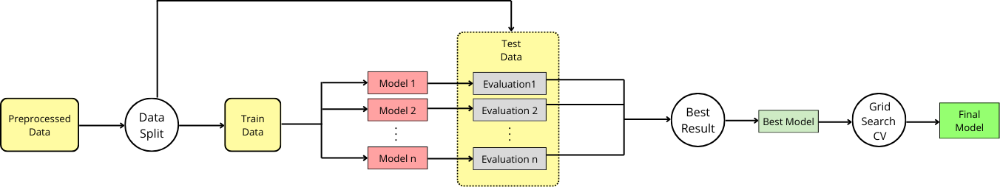
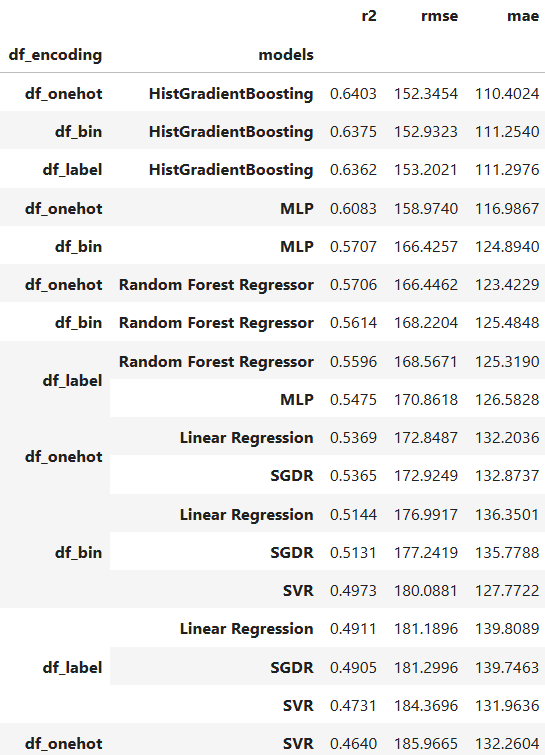
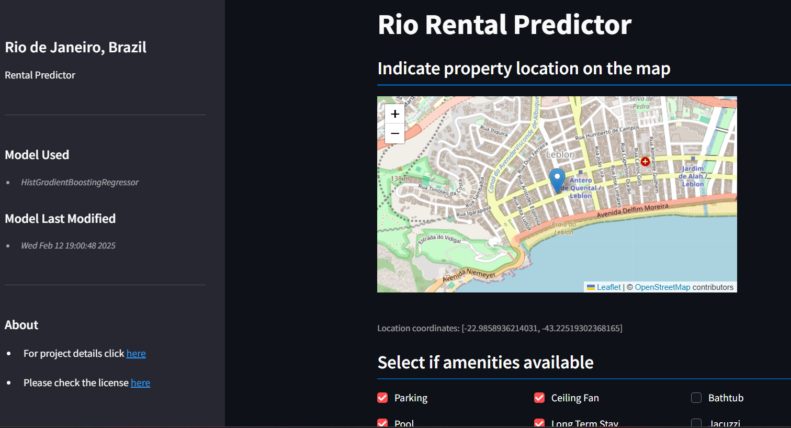
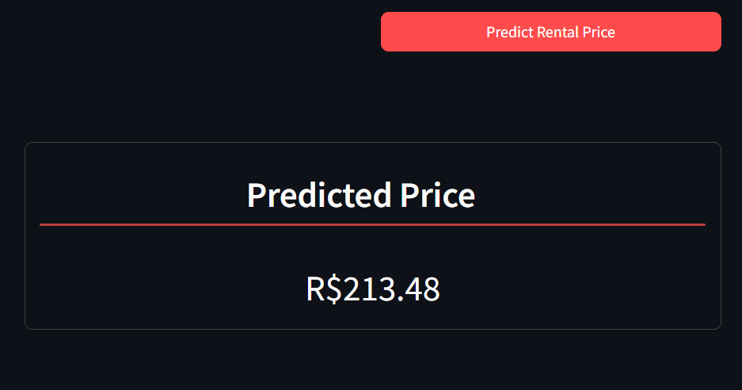
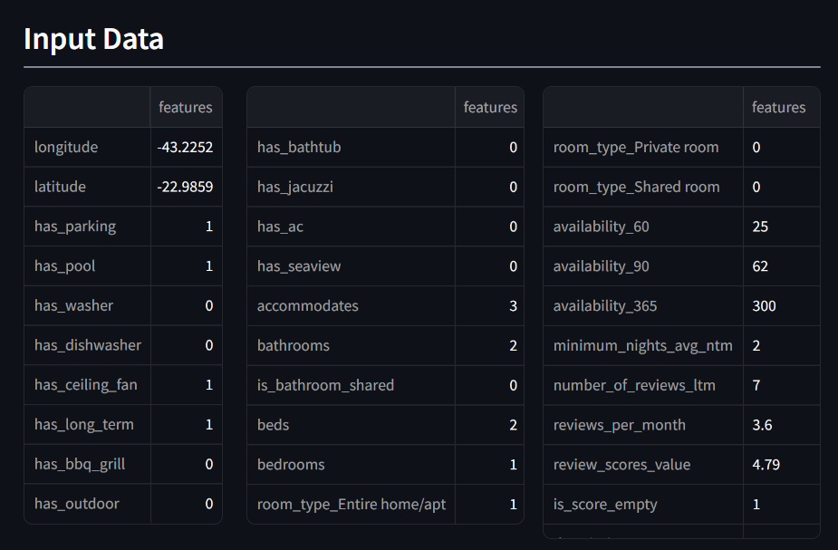
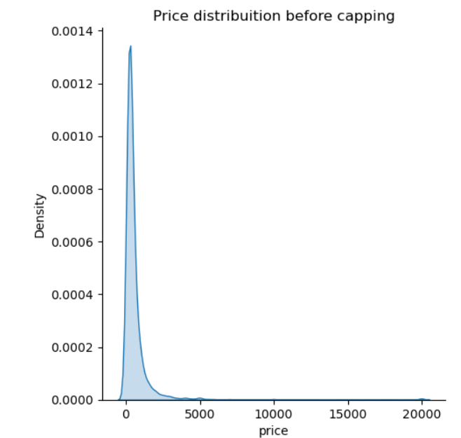
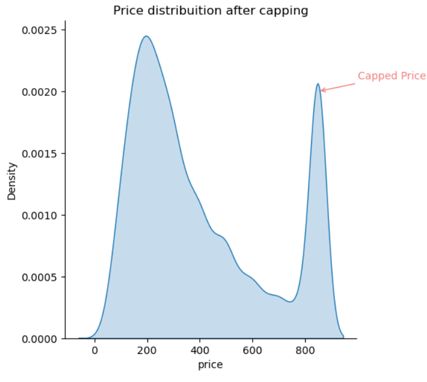
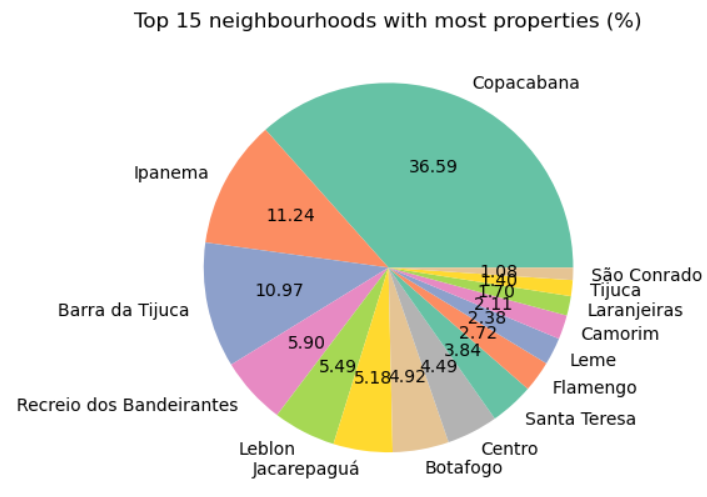

# Airbnb Propeprty Price Predictor 

## Table of Contents
- [About](#about)
- [Data](#data)
    - [Source](#source)
    - [Overview](#overview)
        - [Data Dictionary](#data-dictionary)
        - [Features](#features)
- [Project Overview](#project-overview) 
- [Training](#methodology)
    - [Data Preprocessing Pipeline](#data-preprocessing-pipeline)
    - [Model](#model)
    - [Evaluation](#evaluation)
- [Application](#methodology)
- [Installation](#implementation) 
    - [Download](#installation)
    - [Usage](#usage)
- [Limitations](#limitations)
- [Future Versions](#future-versions)

## About
- The goal of this project was to train an Airbnb property rental price prediction model in the city of Rio de Janeiro, Brazil.
- This is a scientific and academic project and not designed for commercial purposes.
- MIT License.
## Data
### Source
- The training data set was sourced from [Inside Airbnb](https://insideairbnb.com/get-the-data/) and can be found on this [link](https://data.insideairbnb.com/brazil/rj/rio-de-janeiro/2024-06-27/data/listings.csv.gz).

- Inside Airbnb provides quartely data for the last 12 months. It is possible, however, to make an archived data request, if necessary, on this [link](https://insideairbnb.com/data-requests/).
### Overview
#### Data Dictionary
- The features' name and detailed information can be found in the data dictionary provided by Inside Aribnb on this [link](https://docs.google.com/spreadsheets/d/1iWCNJcSutYqpULSQHlNyGInUvHg2BoUGoNRIGa6Szc4/edit?gid=1322284596#gid=1322284596) 
- This project conforms to the definitions from August 2022.
#### Features
- Features relevant for the project:
    - *accommodates*
    - *bathrooms*
    - *bedrooms*
    - *beds*
    - *minimum_nights_avg_ntm*
    - *availability_365*
    - *availability_90*
    - *number_of_reviews_ltm*
    - *review_scores_location*
    - *reviews_per_month*
    - *property_type*
    - *latitude*
    - *longitude*
    - *amenities*  
    - *description*
    - *bathrooms_text*
    - *price*
## Project Overview

The two main folers in this repository that can be consulted to have a more detail vision of this projects are:

- [notebooks](notebooks/): Contain all the initial insights, data exploration, model selection and evaluation.
- [source](source/): Contain a full python implementation for the whole project, including training with its pipelines and the application.

High level overview of project architecture:


 1) Training stage. 
 2) Models generated from the training stage to be used in the App stage.
 3) App stage.

## Training
### Data Preprocessing Pipeline
The diagram bellow illustrates the main data preprocessing pipeline:


1) Data Cleaning
    * NAs:
        - NAs were imputed with a custom values or dropped depending on the case.
            * _price_: NAs were dropped, since price is our target feature.
            * _reviews' features_: NAs replace with 0 indicating the absence of reviews.
            * _score's features_: NAs replaces with 0 indicating as well the absence of rating in that category. OBS: A property can never have a score 0 as the minimum "star" is 1 for properties with the lowest possible rates. In this case the 0 could possibly introduce a ranking order that could confuse the model. It was not observed any considerable impact, however.
            * _bathroom, bedrooms and beds_: NAs were penalized with 0.
            * _description_: NAs simply replaced with empty string, indiccating the absence of a description for the property.
    * Outliers: 
        - Any row exceeding a maximum pre-determined value for select features were capped and assigned that maximum value.
        - For a complete list, check [Limitations](#limitations) section.

2) Feature Extraction
- **Non-binary features**
    * Extracted from 'latitude/longitude' with KMeans a model
        - *geo_location*           

 - **Binary features**
    * Encoded from 'room_type':
        - *is_entire_home*           
        - *is_private_room*
        - *is_shared_room*

    * Extracted from 'bathrooms_text'
        - *is_bathroom_shared*

    * Extracted from 'description'
        - *contains_lux_description*

    * Amenities extracted features:
        - *has_parking*
        - *has_pool*
        - *has_washer*
        - *has_dishwasher*
        - *has_ceiling_fan*
        - *has_long_term*
        - *has_bbq_grill*
        - *has_outdoor*
        - *has_jacuzzi*
        - *has_bathtub*
        - *has_ac*
        - *has_seaview*
3) Feature Selection
- This step simply removes the features not relevant to the problem.
- If more features are automatically extracted in future versions, this step could contain a more sophisticated feature selection such as dropping low correlations or reduntant features
4) Scaling
- Since some of the models are sensitive to the difference in the magnitude of the data (SVM and Neural Networks for example), a step to scale the data was added at the end of the pipeline:
    * MaxMinScaler()

### Model

- In order to achieve the final model, the following steps were necessary:


1) Preprocessed Data Split
2) Multiple models training with training data
3) Models evaluation with test data 
4) Best model selection
5) GridSearch with Cross validation with best model
6) Final Model

### Evaluation
- To evaluate and determine the best model, different regression models were evaluated with different versions of the dataset based on its encoding method for some of its categorical features.
- All the results were compared using the bellow metrics.
- Finally, for the best model, additional optimisation technique was implemented to find the best combination of hyperparameters.

**Models**
- A varierty of linear, decision trees, support vector, neural network and ensemble methods were used in order to determine the best model.
- The following models were used:
    - *LinearRegression()*
    - *RandomForestRegressor()*
    - *SVR()*
    - *SGDRegressor()*
    - *MLPRegressor()*
    - *HistGradientBoostingRegressor()*

**Encoding**
- The different types of encoding techniques used were:
    - *Label Encoding*
    - *One-Hot-Encoding*
    - *Binary Encoding*

**Metrics**
- 
- To determine the best model:
    * R2: How well the model explains the variance of the data.

- In addition, the following metrics were calculated for further reference and analysis of the models:
    * MAE: The average absolute difference of predicted and actual values.
    * RMSE: Also measures the average error, but penalising outliers.




**Best Model**
- For the best model, GridSearch with cross validation technique was used to try to optimise it.
- The model with that achieved the best results so far was the *HistGradientBoostingRegressor()*, with an R2 score of 0.65.
- The last section os this document proposes ideas for future versions that have not been implemented yet aiming to improve this value.


## Application
- The application was made using Streamlit’s open-source framework: 
    * Version: 1.42.0
    * For more information and documentation, you can check their website [here](https://streamlit.io/).
    * For the map functionality, the streamlit-folium open source package was used: 
        * Version: 0.24.0
        * For more information and documentation, you can check their website: [here](https://folium.streamlit.app/).

- _Disclamer: The focous of this project was the model training an its integration into an application. The user interface is meant to be an example of a final product of that integration, without paying much attention to design principles and user interface guidelines. (My apologies for the experts in the domain.)_

Landing page containing a sidebar with project and model information on the left and the start of user input fields:

Show the price predicted for the input data given by the user:

Show the recap to the user of the input data:


## Installation
- The code in its entirety can be clonned from GitHub.
- (!) The dataset, as mentioned before, needs to be downloaded from the source, as advised by Inside Airbnb. 
### Download
*Python Version: 3.12.9*
1. Clone the repository
    ```sh
    git clone https://github.com/CarlosTussi/rio_listings.git
    ```
2. Change into the project directory
    ```sh
    cd rio-listings
    ```
3. (Recommended) Create a virtual environment
    ```sh
    python -m venv venv
    ```
4. (Recommended) Activate the virtual environment
    - On Windows:
      ```sh
      venv\Scripts\activate
      ```
    - On macOS and Linux:
      ```sh
      source venv/bin/activate
      ```
5. Install the required packages
    ```sh
    pip install -r requirements.txt
    ```
### Usage
- The training and the app run independently as the models are already pre-loaded in the repository.
- Should you wish to change the model, run the trining part first and then the app.
#### Training
1. Download the training dataset [here](https://data.insideairbnb.com/brazil/rj/rio-de-janeiro/2024-06-27/data/listings.csv.gz) if not already done.
2. Place the downloaded data inside the 'data' folder
    - Obs: rename it to 'listings.csv' if necessary.
3. Run the following command from the main folder 'rio_listings'
    ```sh
      python -m source.training.main
      ```
#### App
1. Run the following commands from the main folder 'rio_listings'
    ```sh
      $env:PYTHONPATH = (Get-Location)
      streamlit run .\source\app\main.py
      ```
## Limitations
- **Price:**
    * The model has been trained with price values in the following range: (0,850]
    * Values originaly larger than R$850,00 were capped to 850. Therefore, when a property has an estimated value of R$850,00, it should be read, in reality, as a price >= R$850,00.
    * The following charts show the price distribution before and after capping.
     


- **Other capped values:**
    * As with the price, the value for the following features were capped to better generalize and deal with the outliers (more details on the EDA-FE.ipynb in the notebook's folder.).
    * Once again, the capped limit indicates that the predicted value can be >= to that limit.
        - bathrooms: [0, 5],
        - bedrooms: [0, 5],
        - beds: [0, 8],
        - accommodates: [0, 10],
        - number_of_reviews: [0, 10],
        - number_of_reviews_l30d: [0, 2.5],
        - reviews_per_month: [0, 4],
        - number_of_reviews_ltm: [0, 30],
        - minimum_nights: [0, 5],
        - maximum_nights: [0, 800],
        - minimum_minimum_nights: [0, 5],
        - maximum_minimum_nights: [0, 6],
        - minimum_nights_avg_ntm: [0, 5],

- **Neighbourhoods:**
    * Instead of analysing properties in their respective neighbourhoods, they were grouped into clusters according to their coordinates as explaiend before, given the imbalance between property and neighbourhoods as shown in the pie chart bellow.
    


- **Seasonality:**
    * The model does not take into consideration seasonality for the moment which could improve the model. (Ex: Carnival season)

## Future Versions
Here are some ideas and suggestions for future versions:  
- Periodically retrieve more data with new and updated properties when they get released on Insde Airbnb's website.
    * Take seasonality into consideration (summer holidays, carvinal, etc.)
    * Augmentation of our training data to better represent the problem space.
- Deeper analysis of description and amenities strings to improve correlation while avoiding overfitting.
- Cross validation technique for the best model selection phase and not only with GridSearchCV as it was done on this project. 


