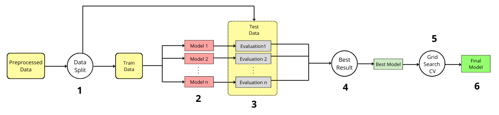

Airbnb Propeprty Price Predictor 

## Table of Contents
- [About](#about)
- [Data](#data)
    - [Source](#source)
    - [Overview](#overview)
        - [Data Dictionary](#data-dictionary)
        - [Features](#features)
- [Project Overview](#project-overview) 
- [Training](#methodology)
    - [Data Preprocessing](#data-preprocessing)
        - [Data Cleaning](#data-cleaning)
        - [Feature Extraction](#feature-extraction)
        - [Feature Selection](#feature-selection)
        - [Scaling](#scaling)
    - [Model](#model)
    - [Evaluation](#evaluation)
- [Application](#methodology)
- [Installation](#implementation) 
    - [Download](#installation)
    - [Usage](#usage)
- [Limitations](#limitations)
- [Future Versions](#future)

## About
    - The goal of this project was to train an Airbnb property rental price prediction model in the city of Rio de Janeiro, Brazil.
    - This is a scientific and academic project and not designed for commercial purposes.
    - MIT License.
## Data
### Source
- The training data set was sourced from [Inside Airbnb](https://insideairbnb.com/get-the-data/) and can be found on this [link](https://data.insideairbnb.com/brazil/rj/rio-de-janeiro/2024-06-27/data/listings.csv.gz).

- Inside Airbnb provides quartely data for the last 12 months. It is possible, however, to make an archived data request, if necessary, on this [link](https://insideairbnb.com/data-requests/).
### Overview
#### Data Dictionary
- The features' name and detailed information can be found in the data dictionary provided by Inside Aribnb on this [link](https://docs.google.com/spreadsheets/d/1iWCNJcSutYqpULSQHlNyGInUvHg2BoUGoNRIGa6Szc4/edit?gid=1322284596#gid=1322284596) 
- This project conforms to the definitions from August 2022.
#### Features
- Features relevant for the project:
    - *accommodates*
    - *bathrooms*
    - *bedrooms*
    - *beds*
    - *minimum_nights_avg_ntm*
    - *availability_365*
    - *availability_90*
    - *number_of_reviews_ltm*
    - *review_scores_location*
    - *reviews_per_month*
    - *property_type*
    - *latitude*
    - *longitude*
    - *amenities*  
    - *description*
    - *bathrooms_text*
    - *price*
## Project Overview
High level overview of project architecture.

## Training
### Data Preprocessing


 - Data Preparation Models
    - *KMeans()*
    - *MaxMinScaler()*
#### Data Cleaning
    - Nas - what was done
    - Outlier - what was done
#### Feature Extraction
 - (Non-binary features)
    * Extracted from 'latitude/longitude' with KMeans a model
        - *geo_location*           

 - (Binary features)
    * Encoded from 'room_type':
        - *is_entire_home*           
        - *is_private_room*
        - *is_shared_room*

    * Extracted from 'bathrooms_text'
        - *is_bathroom_shared*

    * Extracted from 'description'
        - *contains_lux_description*

    * Amenities extracted features:
        - *has_parking*
        - *has_pool*
        - *has_washer*
        - *has_dishwasher*
        - *has_ceiling_fan*
        - *has_long_term*
        - *has_bbq_grill*
        - *has_outdoor*
        - *has_jacuzzi*
        - *has_bathtub*
        - *has_ac*
        - *has_seaview*

#### Feature Selection
- Dropping columns
#### Scaling
- MaxMinScaler()
### Model

- *LinearRegression()*
- *RandomForestRegressor()*
- *SVR()*
- *SGDRegressor()*
- *MLPRegressor()*
- *HistGradientBoostingRegressor()*
### Evaluation
- Metrics used and why
## Application
- Disclamer: The focous of this project was the model training an integration. The user interface is just meant to be an example of that integration, without paying much attention to design principles and user interface guidelines. (My apologies for the experts in the domain.)
- [Images of the webapp]
- Technology used: streamline
- Click map, default values, price at the end, etc etc
## Installation
- The code in its entirety can be clonned from GitHub.
- (!) The dataset, as mentioned before, needs to be downloaded from the source, as requested by Inside Airbnb. 
### Download
*Python Version: 3.12.9*
1. Clone the repository
    ```sh
    git clone https://github.com/CarlosTussi/rio_listings.git
    ```
2. Change into the project directory
    ```sh
    cd rio-listings
    ```
3. (Recommended) Create a virtual environment
    ```sh
    python -m venv venv
    ```
4. (Recommended) Activate the virtual environment
    - On Windows:
      ```sh
      venv\Scripts\activate
      ```
    - On macOS and Linux:
      ```sh
      source venv/bin/activate
      ```
5. Install the required packages
    ```sh
    pip install -r requirements.txt
    ```
### Usage
- The training and the app run independently as the models are already pre-loaded in the repository.
- Should you wish to change the model, run the trining part first and then the app.
#### Training
1. Download the training dataset [here](https://data.insideairbnb.com/brazil/rj/rio-de-janeiro/2024-06-27/data/listings.csv.gz) if not already done.
2. Place the downloaded data inside the 'data' folder
    - Obs: rename it to 'listings.csv' if necessary.
3. Run the following command from the main folder 'rio_listings'
    ```sh
      python -m source.training.main
      ```
#### App
1. Run the following commands from the main folder 'rio_listings'
    ```sh
      $env:PYTHONPATH = (Get-Location)
      streamlit run .\source\app\main.py
      ```
## Limitations
- Price max 850 (before and after chart ?)
- Capped values (#+) (before and after chart ?)
- Pie chart with % and most frequent neighbourhoods.
- Seasonality (high season x low season prices) = conplexity in achieving model improvement

## Future Versions
- Deeper analysis of description and amenities text to improve correlation while avoiding overfitting
- Retrain the model with new data (new properties)
- CV for the different model trainings before the grid search

