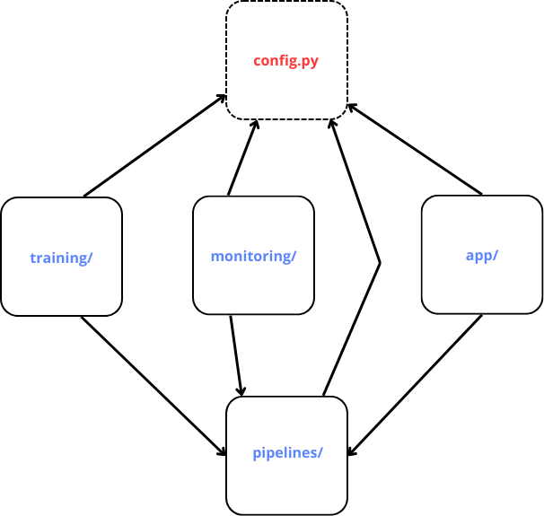

# Source code structure

> * **_training/_**
- **_main.py_**

    - Starting point of the training module.
- **_data_preprocess.py_**
    - Module resposible for preprocessing the data.
- **_model_training_evaluation.py_**
    - Module responsible for training the data and evaluating the trained model.

    >_OBS: GridSearchCV is disactivated by default as it was used before to get the best parameters that are now already coded to be used directly with the best model and best parameters. Should you wish to activate it to try different values, you can change the model_training() function call to enable it._

> * **_pipelines/_**
- **_custom_transformers.py_**

    - Custom transformers implementatios that are used throughout the project.
- **_pipelines.py_**
    - Contains all the pipelines used in the project.
> * **_app/_**
- **_main.py_**

    - Starting point of the app module.
- **_processing_predict.py_**
    - Preproceess user input data and predict property price based on that data.
- **_gui.py_**
    - All the elements from the user interface.
